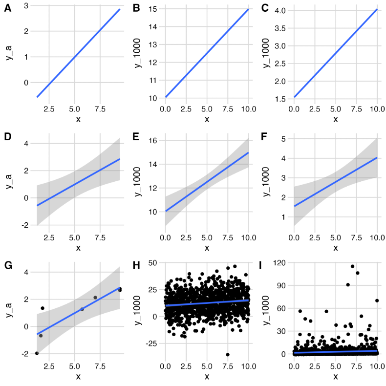
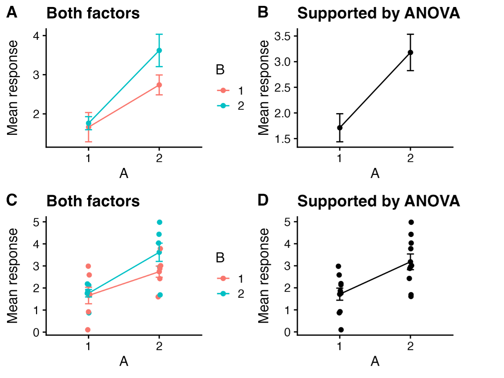

 *Hank Stevens1,2, Tereza Jezkova1,2, Jessica
McCarty3*

 *1 Ph.D. Program in Ecology, Evolution, and Environmental
Biology, Miami University, Oxford, OH, USA*

*2 Department of Biology, Miami University, Oxford, OH, USA*

*3 Department of Geography, Miami University, Oxford, OH,
USA (now at NASA-Ames)*

# Reporting results

Communicate results in a way that makes sense to other people.

## Convey biological meaning

 Kathy Cottingham, Michael Crawley, and lots of others advise us to express quantitative results in a biologically meaningful way and provide both estimates and confidence intervals:
 
 - “Leaf area increased by an average of 20% (95% CI, 15.7-28.4%).”

- “Stem density decreased with increasing soil CEC, declining by 9.4 stems ha-1 per 5 milliequivalents / 100 g soil (95 % CI: 5.3-14.9 stems ha-1)”

You can do better than to state merely that “leaf area increased significantly” or worse, that the “relationship between stem density and CEC was significant”. Don’t waste the space -- just tell us what the relationship was. Convey meaning.

## Tradeoffs in graphical displays

 What is the goal of a graph? Is it to reveal an analysis or a result? Assess assumptions or provide predictions? Regardless, the graphical display of a result represents a tradeoff between showing us the supported finding versus showing us enough data to help us understand the basis of the result and the biological implications. Authors need to make conscious decisions about their intent. Below are a few examples of choices and potential problems.

*Should you show us your data?* The subfigures A, D, G are all based on the same seven x,y pairs, but we add progressively more information from A to D to G. The same is true for the center column using 1000 x,y pairs with normally distributed *y* (B, E, H), and for the right column using 1000 x,y pairs but with lognormally distributed *y* (C, F, G).

<table>
<colgroup>
<col style="width: 33%" />
<col style="width: 32%" />
<col style="width: 33%" />
</colgroup>
<tbody>
<tr>
<td style="text-align: center;">Dataset A</td>
<td style="text-align: center;">Dataset B</td>
<td style="text-align: center;">Dataset C</td>
</tr>
<tr>
<td colspan="3" style="text-align: center;"></td>
</tr>
<tr>
<td colspan="3" style="text-align: center;"><blockquote>

Figure 1. For each dataset (A-C), we can reveal little information
(first row) or a lot of information (bottom row).

</blockquote></td>
</tr>
</tbody>
</table>

 *Which experimental factors should you plot?* Another important issue to consider is whether to plot all treatment combinations, or just those that are supported by statistical tests. For instance, if you predict, *a priori*, that factors A and B interact multiplicatively, but your model (ANOVA) suggests that only A affects the response, should you graph your data in a way that shows both A and B, or show only the effect of A? Inquiring minds want to know and often disagree.

 Figure 2. Our experiment tested the overall and interactive effects of factors A and B on a response. ANOVA showed support for an effect of A, but *not* for effects of B nor an interaction. Should you plot everything you investigated and let us see the various outcomes (A, C), or plot only the effect that has statistical support (B,D)?

 *Dynamite plots are plots that can blow up in your face.* See, for instance,

[<u>https://simplystatistics.org/posts/2019-02-21-dynamite-plots-must-die/</u>](https://simplystatistics.org/posts/2019-02-21-dynamite-plots-must-die/)

## Beyond p-values

 In 2019, The American Statistical Association devoted an issue of their journal, *The American Statistician*, on [<u>“Moving to a World> Beyond ‘p \<> 0.05’”</u>](https://doi.org/10.1080/00031305.2019.1583913). They state,

*In sum, “statistically significant”— don’t say it and don’t use it.* 

The authors ask us to “ATOM”:

1.  **<u>A</u>**ccept uncertainty
2.  Be **<u>T</u>**houghtful
3.  Be **<u>O</u>**pen and transparent
4.  Be **<u>M</u>**odest

We strongly encourage you to use the link above to access the opening editorial for that issue of the journal. All that their advice entails, and what practical steps we take if we no longer can say “statistically significant”, is waaaay beyond the scope of this short document. Nonetheless, one step we can all take now is to ***convey biological meaning*** when we report our results.

 Remember that most of the analyses we do in ecology are, strictly speaking, exploratory. The only confirmatory analyses we do are those that are entirely prescribed beforehand. Your transformation of the response variable and your experimental design would have to be determined before you even do the experiment and witness the data. Any adjustment you make after that will tend to result in anti-conservative *p* values. Every decision after we have the data in hand as we try to figure out what is going in our data or in our study system will tend to increase this anti-conservative bias. The more tests we do with a particular data set -- even if our tests are pre-planned -- the more likely we are to mistakenly reject the null hypothesis. Do what you can to use methods that do not rely on tests that are designed to be confirmatory.

 An example: In the afore mentioned special issue, [Benjamin and Berger (2019)](https://doi.org/10.1080/00031305.2018.1543135) suggest using the Bayes factor bound (BFB, Held and Ott 2018) to convey the strength of evidence in favor of an alternative (H1) over the null (H0). Under a wide range of conditions, it is the upper bound on the odds ratio in favor of H1. An alternative they suggest is the upper bound on the probability in favor of H1, PrU(H1\|data), which is just a function of BFB. [I wrote a simple R script to calculate BFB and PRU(H1\|data)](https://drive.google.com/open?id=1e2hCQcwq5FpdC4-L2eJwiy49RK6rWB9h). Will ecologists use this or something like it? Only the Shadow knows. More importantly, our results should [<u> convey ecological meaning</u>]

## More good practice, in general

[Butler, Ruth. 2021. Popularity leads to bad habits: Alternatives to“the statistics” routine of significance, “alphabet soup” and dynamiteplots. *Annals of Applied Biology*](https://doi-org.proxy.lib.miamioh.edu/10.1111/aab.12734).

[Popovic, G., Mason, T. J., Drobniak, S. M., Marques, T. A., Potts, J.,
Joo, R., Altwegg, R., Burns, C. C. I., McCarthy, M. A., Johnston, A.,
Nakagawa, S., McMillan, L., Devarajan, K., Taggart, P. L., Wunderlich,
A., Mair, M. M., Martínez-Lanfranco, J. A., Lagisz, M., & Pottier, P.
(2024). Four principles for improved statistical ecology. *Methods in
Ecology and Evolution*, 15, 266–281.](https://doi-org.proxy.lib.miamioh.edu/10.1111/2041-210X.14270)

# Reporting Methods:  Say what you did, not what software functions you used.

To the extent possible, explain what you did in computational, statistical, or mathematical terms, without relying on software jargon. For instance, you should say, “I performed a one-way ANOVA”  rather than “I used the aov() command in R.” I have noticed that many  students fall into the latter habit when describing GIS analyses,  e.g., “I used the Buffer command in ESRI ArcGIS” or some such phrase.  That doesn’t seem right to me, and a quick perusal of 4 articles in  *Ecology* that used GIS tools included no such language. *The authors  explained what they did in computational, statistical, or mathematical  terms*, and merely cited software packages or computing languages that allowed them to do those calculations. Nonetheless, I cannot speak about conventions in other journals that publish studies relying on  GIS. I urge you to consult recent issues of relevant journals for articles that use GIS methods to see how successful authors describe their methods. These days, you can always offer the journal an online supplemental with your code. When appropriate, consult with relevant faculty whose expertise lies in such an area; offer acknowledge or co-authorship if the situation warrants it.

 If you transform your data prior to analysis, explain why you transformed it, and indicate how much the transformation helped. And...refer to the analysis as “\[analysis name\] with \[transformation\] data”, e.g., “regression with both variables log-transformed” or “two-way analysis of variance with the response transformed using the arcsine of the square root of y.”

## Bayesian Analysis Reporting Guidelines

### Things to include somewhere in your paper 
Put the following information into either the text or table of the Methods or a supplement:

1. The model (likelihood and priors)
1. How you estimated the parameters of the model (i.e., ran the model)
   a. State the method (MCMC, quadratic approximation, MLE, etc.)
   a. Cite the core R or Python version (use `citation()` # for R Core Team)
   a. Cite any packages that were central to the analysis. Find the citation using, e.g., `citation(package="rstan")`.
   a. The number of MCMC chains, iterations per chain, and the amount of warm-up for Stan or burn-in for BUGS/JAGS.
1. How you checked or diagnosed the *estimation procedure* (e.g., MCMC convergence and mixing of the chains)
   a. For parameters: R-hat, effective sample size (bulk and tail ESS)
   a. Overall for chains, trace plots, trace-rank plots, or the graphical test of uniformity (Sailynoja et al. 2022).
1. How you checked assumptions of the *model* (e.g., error distribution and homogeneity of variances, etc.)
   a. Standard residual plots: graphical checks and statistical tests of relevant residuals or,
   a. Scaled residual plots and tests of assumptions e.g., homogeneity of variances using scaled residuals. See the wonderful DHARMa package: Hartig F, 2024. DHARMa: Residual Diagnostics for Hierarchical (Multi-Level/Mixed) Regression Models. doi:10.32614

### For a very thorough list of considerations

See Kruschke,John K. [Bayesian Analysis Reporting Guidelines.” *Nature HumanBehaviour* 5, no. 10 (October 2021): 1282–91.](https://doi.org/10.1038/s41562-021-01177-7). He offers very thorough guidelines. He has a good textbook as well.(*Doing Bayesian Data Analysis: a tutorial using R, JAGS, and Stan. 2nd.ed. 2015. Academic Press / Elsevier.* ISBN: 9780124058880)

# Citing R and added packages

 If you use R, cite it.

 If you use R, use the correct citation.

## When you use R, use citation()

 You can find the correct citation for R by typing citation() at the R prompt:

 \> `citation()`

 *If you generate statistical results using a package other than the included **stats** package, you should cite it.* To cite an R package other than the base package or stats package, type citation(package=“package_name”), e.g.,

 \> `citation(package = "nlme")`

 and it will give you the source you should cite.

 People tend to cite R packages that help generate quantitative results and not cite packages used for display. Ask yourself, do you cite Adobe Photoshop™ if you use it to make a pretty graphic? Do you cite Microsoft Word™ when you write your manuscript? Your call.

### You should not cite RStudio (or Positron or Jupyter Notebook)

RStudio is just a GUI, or wrapper, for R, albeit a really useful one. When you download RStudio, you are not downloading R. To cite RStudio might be like citing Microsoft Word for generating ideas. Citing RStudio might be like citing the Mac OS or Windows, "All statistics were performed using Windows 8.0.3." The operating system or GUI version you use does not usually matter, with some important exceptions that we discuss next.

There are some very limited exceptions to the "Do not cite RStudio" rule. The only exception is if you are publishing in a data-specific or models-specific journal in which you must list which version of RStudio and the computer operating system on which you tested your own software. Any time you *test software*, you should cite the underlying hardware and software you use.

Likewise, anyone maintaining a GitHub page or other repository should list that information in all the shared codes, commits, and ReadMe documents that are shared for larger scientific use. Be ready to have that information to share with audience members during oral and poster presentations.

# Phylogenetic analyses

*Contributed by Tereza Jezkova*

## Building trees

When constructing a phylogenetic tree, you should report the following:

1)  What genes and how many base pairs were used to reconstruct a tree

2)  What model was used (e.g. HKY+I+G) and how was the model selected

3)  Whether you partitioned by gene, codon, or both

4)  What method was used to build a tree (e.g. Maximum Parsimony,   Maximum Likelihood, etc.)

5)  How was the node support assessed (e.g., using bootstrapping,   posterior probabilities)

## Preparing figures
When preparing a tree figure for a manuscript, remember to:

1)  Indicate the support of nodes. If possible, write all support values   directly on the tree. Alternatively, you can indicate all highly   supported nodes (based on your criterion) by e.g., placing dark dots   on them.

2)  Include branch length units. These are usually either percent of   divergence or time.

# *Points of Significance* - An authoritative source for biologists

A credible source for many of these ideas and more:

[<u>Point of> Significance</u>](https://www.nature.com/collections/qghhqm/pointsofsignificance) is a nice collection of authoritative articles for biologists that provide introductions to a wide variety of statistical topics such as,

- *t*-tests
- replication
- split-plot ANOVA
- Bayes theorem
- logistic regression
- regression diagnostics

and much, much more.